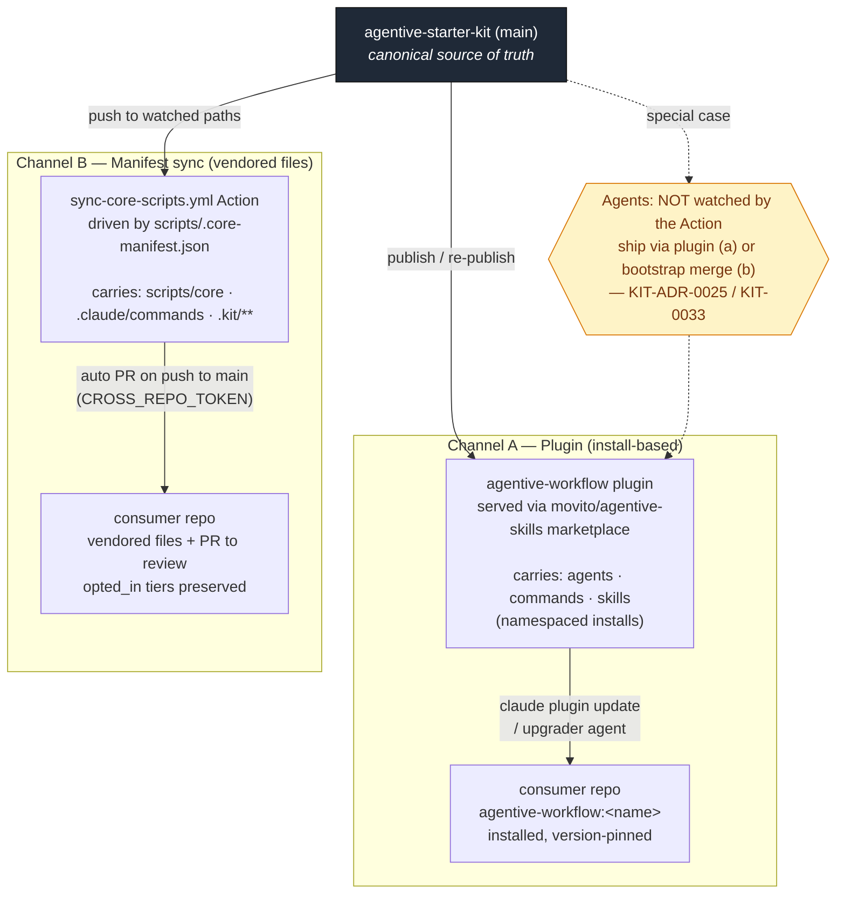

# Distribution Architecture

> How `agentive-starter-kit` distributes agents, commands, and shared
> tooling to downstream projects — and how to keep everything updated.

**Version**: 1.1.0
**Last updated**: 2026-07-04
**Status**: Current
**Related**: `docs/MANIFEST-UPGRADE-GUIDE.md`, `docs/PLUGIN-UPGRADE-GUIDE.md`,
`docs/CROSS-REPO-PATTERN.md`, ADR-0008, KIT-ADR-0022, KIT-ADR-0024, KIT-ADR-0025,
KIT-ADR-0026

---

## TL;DR

- **One upstream source of truth**: this repo.
- **Two distribution channels**: a **plugin** (install-based) and a
  **manifest sync** GitHub Action (vendored-file-based).
- **Commands & scripts propagate two ways** (Channel B): a **push** —
  merging to `main` fires the sync Action, which opens PRs downstream — and,
  since KIT-ADR-0026, a **pull** — a consumer runs `./scripts/core/project
  sync` to fetch updates on demand (selective or full, version-pinnable).
  Both feed one tested engine, so they can't drift.
- **Agents do not auto-propagate** via either path today — the pull channel
  carries scripts/commands/kit files, **not** agents, which still ship
  through the plugin or a bootstrap merge. Closing that asymmetry is tracked
  as KIT-0026.
- **Everything is semver-pinned**: agents in frontmatter (`version`),
  the sync unit via `core_version` in the manifest.

---

## 1. One upstream source of truth

`agentive-starter-kit` (`movito/agentive-starter-kit`) is the canonical
origin for all shared tooling — agents, commands, skills, scripts,
templates, ADRs. Everything downstream is a copy or an install of what
lives here. Nothing is authored in a consumer repo and pushed back up.

## 2. Two distribution channels

Rendered view (GitHub renders Mermaid natively):



Plain-text view (terminals, diffs, non-Mermaid viewers):

```text
                 ┌───────────────────────────────────────────┐
                 │        agentive-starter-kit (main)         │
                 │           canonical source of truth        │
                 └───────────────┬───────────────┬───────────┘
                                 │               │
         Channel A: PLUGIN       │               │   Channel B: MANIFEST SYNC
         (install-based)         │               │   (vendored file copies)
                                 ▼               ▼
      ┌──────────────────────────────┐   ┌──────────────────────────────────┐
      │ agentive-workflow plugin      │   │ sync-core-scripts.yml (Action)    │
      │ served via                    │   │ driven by                         │
      │ movito/agentive-skills        │   │ scripts/.core-manifest.json       │
      │ marketplace                   │   │                                   │
      │                               │   │ on push to watched paths on main: │
      │ carries:                      │   │  • matrix over downstream repos   │
      │  • agents  (namespaced)       │   │  • copy files per manifest tiers  │
      │  • commands (namespaced)      │   │  • open a PR (CROSS_REPO_TOKEN)   │
      │  • skills   (namespaced)      │   │                                   │
      │                               │   │ carries:                          │
      │ consumer updates via:         │   │  • scripts/core/**                │
      │  claude plugin update         │   │  • .claude/commands/**            │
      │  (or the `upgrader` agent)    │   │  • .kit/** templates/skills/ADRs  │
      └───────────────┬──────────────┘   └────────────────┬─────────────────┘
                      │                                    │
                      ▼                                    ▼
      ┌──────────────────────────────┐   ┌──────────────────────────────────┐
      │ consumer repo                 │   │ consumer repo                     │
      │  agentive-workflow:<name>     │   │  vendored files + PR to review    │
      │  installed, version-pinned    │   │  opted_in tiers preserved         │
      └──────────────────────────────┘   └──────────────────────────────────┘
```

Why two channels: the plugin gives consumers *installable, version-pinned*
artifacts they don't maintain; the manifest sync is for files that must
physically live in the consumer's tree (scripts they run, commands,
kit-builder scaffolding).

| | **Channel A — Plugin** | **Channel B — Manifest sync** |
|---|---|---|
| **What** | `agentive-workflow` plugin, from the `movito/agentive-skills` marketplace | `sync-core-scripts.yml` Action + `scripts/.core-manifest.json` |
| **Carries** | Agents, commands, skills as **namespaced installs** (`agentive-workflow:feature-developer-v7`, `agentive-workflow:check-ci`) | **Vendored file copies**: `scripts/core/`, `.claude/commands/`, `.kit/` templates/skills/ADRs/workflows |
| **Consumer update path** | `claude plugin update` / `upgrader` agent | **Push**: automated PR into the consumer repo. **Pull**: `./scripts/core/project sync` from the consumer (on-demand, KIT-ADR-0026) |
| **Governed by** | KIT-ADR-0024 §3, KIT-ADR-0025 | ADR-0008, KIT-ADR-0022, KIT-ADR-0026, `docs/MANIFEST-UPGRADE-GUIDE.md` |

### Canonical homes (KIT-ADR-0027 P6)

One repo home per artifact type; the plugin carries distribution
copies of each, namespaced `agentive-workflow:<name>`.

| Artifact | Canonical repo home | Plugin |
|----------|--------------------|--------|
| Agents | `.claude/agents/` | distribution copies |
| Commands | `.claude/commands/` | distribution copies |
| Skills | `.claude/skills/` (implementation AND builder) | distribution copies |

`.kit/skills/` is deprecated: it holds read-both symlinks into
`.claude/skills/` for one release and is removed in 0.9.0 (KIT-0059).

## 3. The tiered manifest (Channel B's brain)

`scripts/.core-manifest.json` — `core_version` is the semver of the sync
unit (currently `3.0.0`). Files are grouped into **tiers**, and tier
membership decides who receives what:

| Tier | Count | Sync rule |
|------|-------|-----------|
| `scripts_core` | 17 | Always sync to every downstream |
| `commands_core` | 6 | Always sync to every downstream |
| `commands_optional` | 5 | Sync **only if** consumer opted in |
| `kit_builder` | 14 | Sync **only to** kit-family repos (`is_kit: true`) |

`commands_core` is the "most essential commands" set:
`check-ci`, `check-bots`, `wait-for-bots`, `start-task`,
`commit-push-pr`, `preflight`.

A consumer's `opted_in` array is **preserved across syncs** — the Action
reads the downstream manifest and never clobbers the consumer's tier
choices.

## 4. The sync Action mechanics

`.github/workflows/sync-core-scripts.yml` fires on push to `main` when any
watched path changes (`scripts/core/**`, `.claude/commands/**`,
`.kit/templates/**`, the manifest itself, and more). It:

1. runs a **matrix** over downstream repos (today: `dispatch-kit`,
   `adversarial-workflow`, `adversarial-evaluator-library`),
2. checks out source + target, walks the manifest tier-by-tier honoring
   the opt-in / kit-only rules,
3. copies files and opens a **PR** into each consumer using the
   `CROSS_REPO_TOKEN` secret.

Consumers review and merge on their own schedule — nothing is force-pushed.

### 4b. The pull path — consumer-initiated (KIT-ADR-0026)

The push Action is upstream-initiated: a consumer waits for a merge to `main`,
and repos outside the matrix receive nothing. KIT-ADR-0026 adds a **pull**
path so any consumer can sync from its own terminal in under two minutes:

```bash
./scripts/core/project sync --dry-run          # what would change (read-only)
./scripts/core/project sync                     # pull everything entitled
./scripts/core/project sync --tier commands_core   # one tier
./scripts/core/project sync --ref v0.7.0        # pin to a tag, not main
```

Crucially, **one engine backs both paths.** The tier/opt-in/cleanup logic
lives in `scripts/core/sync_from_manifest.py`; the Action and `project sync`
are two thin callers of it, so push and pull cannot diverge. The pull command
resolves its source as `--source <dir>` → `gh api` tarball → shallow clone,
applies to a review branch (or the working tree with `--no-branch`), and marks
partial pulls in the manifest (`partial_sync`) so a mixed-version tree is
explicit. Same review contract as the push PRs: the consumer reads a plain
`git diff` and merges on its own schedule.

The push Action also gained a `workflow_dispatch` trigger (optional `repo`
filter) for on-demand *remote*-initiated syncs.

## 5. Agents are the special case

The sync Action **does not watch `.claude/agents/**`**, and there is no
`agents` tier in the manifest. Agents are deliberately **not** file-synced.
Two mechanisms cover them instead.

### (a) Plugin body + runtime-read localization — KIT-ADR-0025

A shared agent file fuses two things with different lifecycles:

1. **Workflow body** — phases, gates, the CI/review loop, shell rules.
   Plugin-owned; the point of distribution is that consumers *receive
   upgrades* to this.
2. **Project specifics** — tech stack, task-ID prefix, repo topology,
   local test/lint commands, which Serena project to activate.
   Project-owned; these *must survive* an upgrade.

Resolution: **the distributed body carries zero project specifics.** Agents
read their specifics at **runtime** from files the project already owns:

| Information | Home | How the agent gets it |
|---|---|---|
| Topology, target repo, project rules, identity | `CLAUDE.md` | auto-injected every session |
| Tech stack, task-ID prefix, local test loop, stack footguns | `CLAUDE.md` + task spec | read at runtime (early action) |
| Defensive-coding patterns | `.kit/context/patterns.yml` | read at runtime |

A hardcoded Serena project or origin check in a distributed agent is a
**distribution bug**, not a feature to parameterize.

### (b) KIT-LOCAL marker vendoring — KIT-0033

For agents that *are* copied into a consumer (`feature-developer.md`,
`planner.md`, `feature-developer-f5.md`), the project-owned sections are
wrapped in markers:

```markdown
<!-- BEGIN KIT-LOCAL: project-context -->
...consumer-owned content...
<!-- END KIT-LOCAL: project-context -->

<!-- BEGIN KIT-LOCAL: stack-notes -->
...consumer-owned content...
<!-- END KIT-LOCAL: stack-notes -->
```

The consumer engine behind the setup door (`scripts/local/bootstrap
--adopt`, engine `engine-consumer.sh`; KIT-0053) fills these on first
bootstrap and **preserves them byte-for-byte across re-bootstraps** (via
`scripts/local/kit_markers.py`), while upstream refreshes everything
*outside* the markers. This is the
contract that lets a consumer take a workflow-body upgrade without losing
its localization.

> **Known non-goal**: a literal `BEGIN KIT-LOCAL` marker line inside a
> fenced code sample (with no parseable region of that name) makes
> `kit_markers.py` fail fast and abort the merge — by design. A loud
> abort beats a silent clobber, and markdown-fence parsing is out of
> scope for a stdlib helper. Declined twice on PR #70; do not re-raise.

### In transition

KIT-0026 (backlog) proposes adding `agents_core` / `skills_core` tiers so
agents *also* flow through Channel B. Until that ships, agent updates reach
consumers via the plugin (a) or a bootstrap/re-bootstrap merge (b) — **not**
the sync Action, and **not** the new `project sync` pull path either. The
KIT-ADR-0026 engine's per-tier strategy dispatch is designed so an
`agents_core` tier lands as a new tier plus a KIT-LOCAL-marker merge strategy,
not an engine rewrite.

> **The asymmetry to remember:** editing a *command* on `main` opens
> downstream PRs automatically **and** is pullable with `project sync`;
> editing an *agent* is neither — it ships via the plugin or a bootstrap merge.

## 6. Versioning discipline

Per KIT-0029, every canonical agent pins in frontmatter: `model`,
`version` (semver), `last-updated`, `origin`, `created-by`. Rules from
`docs/MANIFEST-UPGRADE-GUIDE.md`:

- **Model-pin-only bump → semver patch**, and update `last-updated`.
- The manifest's `core_version` is the semver of the sync unit as a whole.

Documents (like this one) are semver-stamped too — see the header.

## 7. Two upgrade surfaces, one agent

- `docs/MANIFEST-UPGRADE-GUIDE.md` — the **scripts/manifest** surface
  (Channel B).
- `docs/PLUGIN-UPGRADE-GUIDE.md` — the **plugin** surface (Channel A).
- The **`upgrader` agent** automates the plugin runbook: raises a consumer
  from one plugin version to the next *and* refreshes local agent model
  pins on a rollout, using a two-phase `PREVIEW → operator ACK → APPLY`
  gate (idempotent — a no-op if already current).

---

## The "keeping everything updated" loop

1. Edit the canonical agent/command in `agentive-starter-kit`, bump its
   `version` + `last-updated`, commit to a branch → PR → merge to `main`.
2. **Commands & scripts** (two paths, one engine):
   - **Push** — merging to `main` auto-fires `sync-core-scripts.yml`, which
     opens update PRs in each downstream. Consumers merge on their schedule;
     `opted_in` tiers are respected.
   - **Pull** — a consumer runs `./scripts/core/project sync --dry-run` to see
     what changed and `./scripts/core/project sync` to apply it (selective via
     `--tier`/`--only`, pinnable via `--ref`) without waiting for a push PR.
3. **Agents**: re-publish the plugin (consumers run `claude plugin update`
   or the `upgrader` agent), or the consumer picks up body changes on its
   next bootstrap merge — KIT-LOCAL regions preserved.
4. Consumers verify with the synced `commands_core` gates (`preflight`,
   `check-ci`, `check-bots`).

---

## Glossary

| Term | Meaning |
|------|---------|
| **Upstream / kit** | `agentive-starter-kit` — the canonical source repo |
| **Consumer / downstream** | A project that installs the plugin and/or receives manifest syncs |
| **Kit-family repo** | A downstream that is itself part of the tooling (receives `kit_builder`); `is_kit: true` in the sync matrix |
| **Tier** | A named group of files in the manifest with a shared sync rule |
| **Opt-in** | A consumer's recorded choice to receive a non-core tier (`opted_in` array) |
| **KIT-LOCAL region** | A marker-delimited, consumer-owned section of a vendored agent file |
