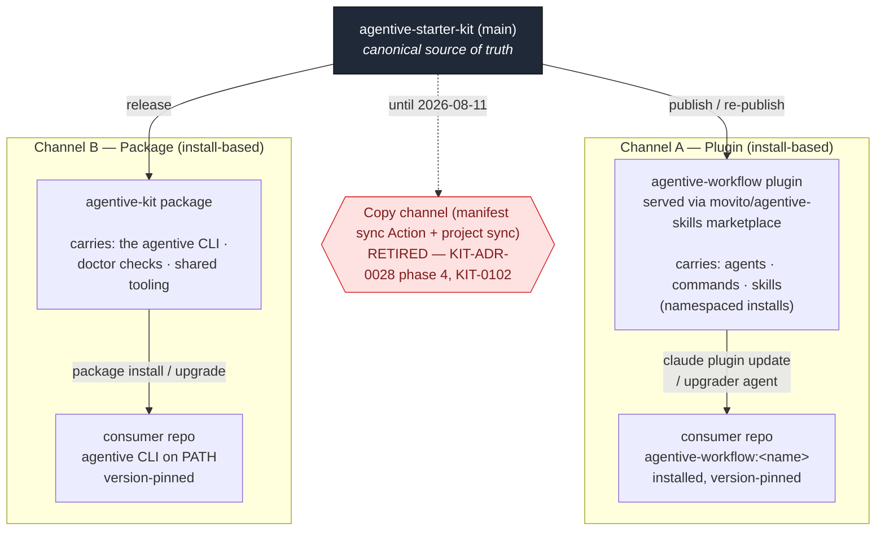

# Distribution Architecture

> How `agentive-starter-kit` distributes agents, commands, and shared
> tooling to downstream projects — and how to keep everything updated.

**Version**: 2.0.0
**Last updated**: 2026-08-11
**Status**: Current
**Related**: `docs/PLUGIN-UPGRADE-GUIDE.md`, `docs/UPDATING-YOUR-PROJECT.md`,
`docs/CROSS-REPO-PATTERN.md`, KIT-ADR-0024, KIT-ADR-0025, KIT-ADR-0028

---

## TL;DR

- **One upstream source of truth**: this repo.
- **Two distribution channels, both install-based**: the
  **agentive-workflow plugin** (agents, skills, slash commands) and the
  **agentive-kit package** (the `agentive` CLI and shared tooling).
- **Nothing is copied downstream any more.** The copy era — a
  `.core-manifest.json` naming a file set, a push Action that opened PRs,
  and a `project sync` pull engine — was **retired in KIT-ADR-0028
  phase 4** (KIT-0102, 2026-08-11). New projects are born packaged.
- **Everything is semver-pinned**: agents in frontmatter (`version`), the
  plugin and package by release version.

> **Reading this for history?** Sections below marked *(retired)* describe
> the copy channel as it worked until 2026-08-11. They are kept because
> ADRs and retros reference them; nothing they describe is live. The
> machinery itself is in git history.

---

## 1. One upstream source of truth

`agentive-starter-kit` (`movito/agentive-starter-kit`) is the canonical
origin for all shared tooling — agents, commands, skills, scripts,
templates, ADRs. Everything downstream is a copy or an install of what
lives here. Nothing is authored in a consumer repo and pushed back up.

## 2. Two distribution channels

Both channels are **install-based**. Nothing is copied into a consumer
tree by upstream any more.

Rendered view (GitHub renders Mermaid natively):


```mermaid
flowchart TD
    SRC["agentive-starter-kit (main)<br/><i>canonical source of truth</i>"]

    subgraph A["Channel A — Plugin (install-based)"]
        PLUGIN["agentive-workflow plugin<br/>served via movito/agentive-skills marketplace<br/><br/>carries: agents · commands · skills<br/>(namespaced installs)"]
        CONSA["consumer repo<br/>agentive-workflow:&lt;name&gt;<br/>installed, version-pinned"]
        PLUGIN -->|"claude plugin update<br/>/ upgrader agent"| CONSA
    end

    subgraph B["Channel B — Package (install-based)"]
        PKG["agentive-kit package<br/><br/>carries: the agentive CLI ·<br/>doctor checks · shared tooling"]
        CONSB["consumer repo<br/>agentive CLI on PATH<br/>version-pinned"]
        PKG -->|"package install / upgrade"| CONSB
    end

    SRC -->|"publish / re-publish"| PLUGIN
    SRC -->|"release"| PKG

    OLD{{"Copy channel (manifest sync Action + project sync)<br/>RETIRED — KIT-ADR-0028 phase 4, KIT-0102"}}
    SRC -.->|"until 2026-08-11"| OLD

    classDef src fill:#1f2937,color:#fff,stroke:#111;
    classDef note fill:#fee2e2,color:#7f1d1d,stroke:#dc2626;
    class SRC src;
    class OLD note;
```

Plain-text view (terminals, diffs, non-Mermaid viewers):

```text
                 ┌───────────────────────────────────────────┐
                 │        agentive-starter-kit (main)         │
                 │           canonical source of truth        │
                 └───────────────┬───────────────┬───────────┘
                                 │               │
         Channel A: PLUGIN       │               │   Channel B: PACKAGE
         (install-based)         │               │   (install-based)
                                 ▼               ▼
      ┌──────────────────────────────┐   ┌──────────────────────────────────┐
      │ agentive-workflow plugin      │   │ agentive-kit package              │
      │ served via                    │   │                                   │
      │ movito/agentive-skills        │   │ carries:                          │
      │ marketplace                   │   │  • the `agentive` CLI             │
      │                               │   │  • doctor checks                  │
      │ carries:                      │   │  • shared Python tooling          │
      │  • agents  (namespaced)       │   │                                   │
      │  • commands (namespaced)      │   │ consumer updates via:             │
      │  • skills   (namespaced)      │   │  package install / upgrade        │
      │                               │   │                                   │
      │ consumer updates via:         │   │                                   │
      │  claude plugin update         │   │                                   │
      │  (or the `upgrader` agent)    │   │                                   │
      └───────────────┬──────────────┘   └────────────────┬─────────────────┘
                      │                                    │
                      ▼                                    ▼
      ┌──────────────────────────────┐   ┌──────────────────────────────────┐
      │ consumer repo                 │   │ consumer repo                     │
      │  agentive-workflow:<name>     │   │  agentive CLI on PATH             │
      │  installed, version-pinned    │   │  version-pinned                   │
      └──────────────────────────────┘   └──────────────────────────────────┘
```

Why two channels: the plugin carries what Claude Code loads (agents,
skills, commands); the package carries what a human or script executes
(the CLI and its tooling). Both are installed and version-pinned, so a
consumer never maintains a copy it did not write.

| | **Channel A — Plugin** | **Channel B — Package** |
|---|---|---|
| **What** | `agentive-workflow` plugin, from the `movito/agentive-skills` marketplace | the `agentive-kit` package |
| **Carries** | Agents, commands, skills as **namespaced installs** (`agentive-workflow:feature-developer`, `agentive-workflow:check-ci`) | The `agentive` CLI, doctor checks, shared Python tooling |
| **Consumer update path** | `claude plugin update` / `upgrader` agent | package install / upgrade |
| **Governed by** | KIT-ADR-0024 §3, KIT-ADR-0025 | KIT-ADR-0028 |

> **Retired: Channel C — manifest sync (copy-based).** Until 2026-08-11 a
> third channel copied files into consumer trees: `sync-core-scripts.yml`
> pushed PRs downstream, and `./scripts/core/project sync` pulled on
> demand, both driven by `scripts/.core-manifest.json`. The push half
> never ran in production (`CROSS_REPO_TOKEN` was never provisioned —
> KIT-0045), and the pull half had no live consumers once projects were
> born packaged. All of it was deleted in KIT-ADR-0028 phase 4 (KIT-0102).
> Governed historically by ADR-0008, KIT-ADR-0022, KIT-ADR-0026.

### Canonical homes (KIT-ADR-0027 P6)

One repo home per artifact type; the plugin carries distribution
copies of each, namespaced `agentive-workflow:<name>`.

| Artifact | Canonical repo home | Plugin |
|----------|--------------------|--------|
| Agents | `.claude/agents/` | distribution copies |
| Commands | `.claude/commands/` | distribution copies |
| Skills | `.claude/skills/` (implementation AND builder) | distribution copies |

`.kit/skills/` is retired (0.9.0, KIT-0059): its one-release read-both
symlinks are gone; `.claude/skills/` is the only skills home.

## 3–4. The manifest and sync mechanics *(retired)*

Sections 3, 4 and 4b of this document described the copy channel's
internals: the tiered manifest (`scripts/.core-manifest.json`) with its
`core_version`, `files` tiers and `opted_in` list; the push Action's
matrix/copy/PR mechanics; and the KIT-ADR-0026 pull path
(`./scripts/core/project sync`, its dry-run/branch/commit behavior and
frozen exit-code contract).

All of it was deleted in KIT-ADR-0028 phase 4 (KIT-0102, 2026-08-11).
The detail is preserved in git history and in ADR-0008, KIT-ADR-0022 and
KIT-ADR-0026 (the last now superseded by KIT-ADR-0028). It is omitted
here because a reader following it today would be configuring machinery
that no longer exists.

## 5. Agents are the special case

The sync Action **does not watch `.claude/agents/**`**, and there is no
`agents` tier in the manifest. Agents are deliberately **not** file-synced.
Two mechanisms cover them instead.

### (a) Plugin body + runtime-read localization — KIT-ADR-0025

A shared agent file fuses two things with different lifecycles:

1. **Workflow body** — phases, gates, the CI/review loop, shell rules.
   Plugin-owned; the point of distribution is that consumers *receive
   upgrades* to this.
2. **Project specifics** — tech stack, task-ID prefix, repo topology,
   local test/lint commands, which Serena project to activate.
   Project-owned; these *must survive* an upgrade.

Resolution: **the distributed body carries zero project specifics.** Agents
read their specifics at **runtime** from files the project already owns:

| Information | Home | How the agent gets it |
|---|---|---|
| Topology, target repo, project rules, identity | `CLAUDE.md` | auto-injected every session |
| Tech stack, task-ID prefix, local test loop, stack footguns | `CLAUDE.md` + task spec | read at runtime (early action) |
| Defensive-coding patterns | `.kit/context/patterns.yml` | read at runtime |

A hardcoded Serena project or origin check in a distributed agent is a
**distribution bug**, not a feature to parameterize.

### (b) KIT-LOCAL marker vendoring — KIT-0033

For agents that *are* copied into a consumer (`feature-developer.md`,
`planner.md`, `feature-developer-f5.md`), the project-owned sections are
wrapped in markers:

```markdown
<!-- BEGIN KIT-LOCAL: project-context -->
...consumer-owned content...
<!-- END KIT-LOCAL: project-context -->

<!-- BEGIN KIT-LOCAL: stack-notes -->
...consumer-owned content...
<!-- END KIT-LOCAL: stack-notes -->
```

The consumer engine behind the setup door (`scripts/local/bootstrap
--adopt`, engine `engine-consumer.sh`; KIT-0053) fills these on first
bootstrap and **preserves them byte-for-byte across re-bootstraps** (via
`scripts/local/kit_markers.py`), while upstream refreshes everything
*outside* the markers. This is the
contract that lets a consumer take a workflow-body upgrade without losing
its localization.

> **Known non-goal**: a literal `BEGIN KIT-LOCAL` marker line inside a
> fenced code sample (with no parseable region of that name) makes
> `kit_markers.py` fail fast and abort the merge — by design. A loud
> abort beats a silent clobber, and markdown-fence parsing is out of
> scope for a stdlib helper. Declined twice on PR #70; do not re-raise.

### Resolved

The old asymmetry — commands propagated by file copy while agents shipped
only via the plugin — is gone. KIT-0026 (proposing `agents_core` /
`skills_core` sync tiers) was **canceled**: the copy channel it would have
extended no longer exists.

> **The rule now:** agents, skills and commands all ship through the
> plugin, and the tooling ships through the package. Editing any of them
> on `main` reaches consumers when the next plugin or package release is
> published — never by an automatic file copy.

## 6. Versioning discipline

Per KIT-0029, every canonical agent pins in frontmatter: `model`,
`version` (semver), `last-updated`, `origin`, `created-by`:

- **Model-pin-only bump → semver patch**, and update `last-updated`
  (procedure: `docs/MANIFEST-UPGRADE-GUIDE.md` § Agent Model Pins).
- The plugin and the package each carry their own release version.

Documents (like this one) are semver-stamped too — see the header.

## 7. Upgrade surfaces

- `docs/PLUGIN-UPGRADE-GUIDE.md` — the **plugin** surface (Channel A).
- `docs/UPDATING-YOUR-PROJECT.md` — the index: what reaches a project
  through which channel, plus the whole-repo merge for everything else.
- `docs/MANIFEST-UPGRADE-GUIDE.md` — retired as an upgrade path; retains
  the **Agent Model Pins** procedure.
- The **`upgrader` agent** automates the plugin runbook: raises a consumer
  from one plugin version to the next *and* refreshes local agent model
  pins on a rollout, using a two-phase `PREVIEW → operator ACK → APPLY`
  gate (idempotent — a no-op if already current).

---

## The "keeping everything updated" loop

1. Edit the canonical agent/command in `agentive-starter-kit`, bump its
   `version` + `last-updated`, commit to a branch → PR → merge to `main`.
2. **Agents, skills, commands**: re-publish the plugin — consumers run
   `claude plugin update` or the `upgrader` agent. KIT-LOCAL regions in
   vendored agent bodies are preserved across a re-bootstrap merge.
3. **CLI and shared tooling**: cut an `agentive-kit` package release;
   consumers upgrade the package.
4. Consumers verify with the plugin's gates (`preflight`, `check-ci`,
   `check-bots`).

---

## Glossary

| Term | Meaning |
|------|---------|
| **Upstream / kit** | `agentive-starter-kit` — the canonical source repo |
| **Consumer / downstream** | A project that installs the plugin and/or the package |
| **Kit-family repo** | A downstream that is itself part of the tooling |
| **KIT-LOCAL region** | A marker-delimited, consumer-owned section of a vendored agent file |
| **Tier**, **Opt-in** | *(retired)* Manifest concepts from the copy channel — a named file group and a consumer's recorded choice to receive it. Removed in KIT-0102. |
